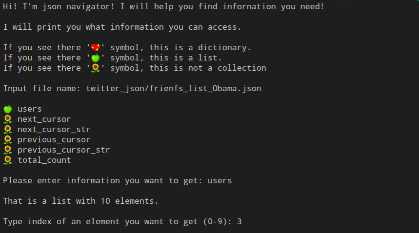
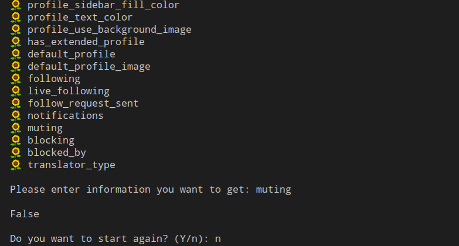

# Json navigator

This is a module that will help to navigate in **json-file**. It outputs alailable elements or number of indices if it is a list, from which user can choose.

## Example of usage

1. The module prints instruction how to use it and user can choose what information s/he wants to see. If it is a dictionary, user will see keys, if it is a list, s/he should input element index.

1. If user reaches the end of the file (information of any type but list or dictionary) the module will ask if user would like to continue or quit.

